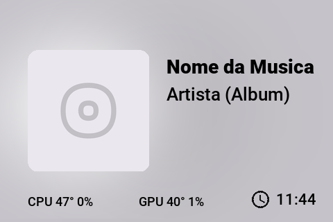
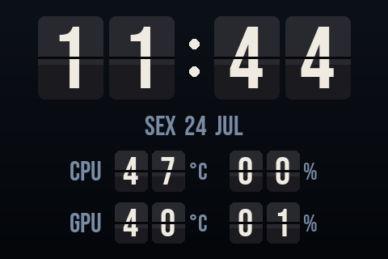
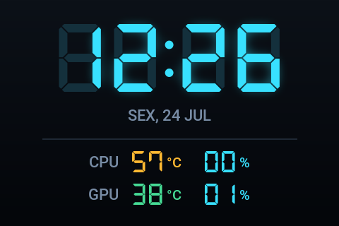

# Turing Music Clock

[English](README.md) · **Português**

> Visualizador de música **e** relógio digital/flip com métricas de CPU e GPU ao vivo para o display USB **Turing Smart Screen 3.5"**.


Quando há música tocando, a tela mostra a capa, o título e o artista. Quando não há nada tocando, vira um **relógio** — você escolhe entre o estilo **digital de 7 segmentos** ou o estilo **flip (painel de aeroporto)** — com **temperatura e uso de CPU/GPU** e a data.

<div align="center">

| Tocando | Relógio flip | Relógio digital |
|:---:|:---:|:---:|
|  |  |  |

</div>

> Fork do [turing-smart-screen-python](https://github.com/mathoudebine/turing-smart-screen-python) (via [spel987/turing-3.5-screen-music-visualizer](https://github.com/spel987/turing-3.5-screen-music-visualizer)). Veja os [Créditos](#créditos).

## Índice

- [Recursos](#recursos)
- [Requisitos](#requisitos)
- [Instalação](#instalação)
- [Como rodar](#como-rodar)
- [Configuração](#configuração)
- [Iniciar com o Windows](#iniciar-com-o-windows)
- [Temperatura da CPU (LibreHardwareMonitor)](#temperatura-da-cpu-librehardwaremonitor)
- [Solução de problemas](#solução-de-problemas)
- [Como funciona](#como-funciona)
- [Créditos](#créditos)
- [Licença](#licença)

## Recursos

- 🎵 **Tela "tocando"** — capa, título, artista e fundo desfocado, lidos direto da sessão de mídia do Windows (SMTC).
- 🕐 **Relógio ocioso em dois estilos** (`digital` de 7 segmentos ou `flip` painel de aeroporto), selecionável por um único parâmetro.
- 🌡️ **Temperatura + uso de CPU e GPU**, com a temperatura da CPU colorida por faixa na tela digital.
- 📅 **Data** com o dia da semana.
- 🔌 **Reconexão automática** — se o cabo USB cair e voltar, ele se recupera sozinho (sem reinício manual).
- 🌑 **Apaga a tela ao sair / desligar**, pra nunca congelar no último frame (útil quando os USBs ficam energizados).
- 🪶 **Leve** (~0,5% de CPU, ~190 MB de RAM) — só redesenha quando algo realmente muda.
- 🚀 **Instalador de um comando** + "iniciar com o Windows" opcional.

## Requisitos

| Item | Necessário para |
|---|---|
| **Turing Smart Screen 3.5"** (revisão A) | tudo — é o display alvo |
| **Windows** | a integração com a mídia (SMTC / `winrt`) é exclusiva do Windows |
| **Python 3.9–3.12** | o instalador configura via `winget` se faltar |
| **GPU NVIDIA** *(opcional)* | temperatura/uso da GPU (via `nvidia-smi`, já vem no driver) |
| **LibreHardwareMonitor** *(opcional)* | **temperatura da CPU** — [veja abaixo](#temperatura-da-cpu-librehardwaremonitor) |

Sem GPU NVIDIA ou sem o LibreHardwareMonitor, o app funciona normalmente — os valores que faltam aparecem como `--`.

## Instalação

No **PowerShell**:

```powershell
git clone https://github.com/raphaeloreis/turing-music-clock.git
cd turing-music-clock
.\install.ps1
```

O `install.ps1` instala o Python (se faltar), cria o ambiente virtual (`.venv`), instala as dependências e pergunta se você quer iniciar o app com o Windows.

> Se o PowerShell bloquear o script, libere para a sessão atual:
> ```powershell
> Set-ExecutionPolicy -Scope Process -ExecutionPolicy Bypass
> ```

## Como rodar

```powershell
.\run.ps1
```

Deixe o display conectado por USB. A porta COM é detectada automaticamente; defina manualmente em `COM_PORT` se precisar (veja abaixo).

## Configuração

Os principais parâmetros ficam no topo do `music-visualizer.py`:

| Parâmetro | Valores | O que faz |
|---|---|---|
| `COM_PORT` | `"AUTO"` ou ex. `"COM5"` | porta serial do display (auto-detecta por padrão) |
| `IDLE_STYLE` | `"digital"` / `"flip"` | estilo do relógio ocioso |
| `IDLE_ACCENT` | RGB, ex. `(56, 225, 255)` | cor do relógio digital |
| `TEMP_REFRESH_SEC` | ex. `3` | de quantos em quantos segundos os sensores são lidos |
| `RECONNECT_WAIT` | ex. `3` | segundos entre tentativas de reconexão |

**Orientação da tela:** no bloco principal, `SetOrientation(orientation=Orientation.REVERSE_LANDSCAPE)` — troque por `LANDSCAPE`, `PORTRAIT` ou `REVERSE_PORTRAIT`.

## Iniciar com o Windows

```powershell
.\scripts\setup-autostart.ps1
```

Cria uma tarefa agendada que sobe o app ao logon (atraso de 30 s, oculta, sem janela). Para remover:

```powershell
Unregister-ScheduledTask -TaskName TuringMusicClock
```

## Temperatura da CPU (LibreHardwareMonitor)

No Windows, a temperatura da CPU não pode ser lida direto pelo Python — precisa de um driver de kernel e privilégio de admin (justamente o que os apps de monitoramento fazem). A forma confiável é usar o **LibreHardwareMonitor** como fonte:

1. Baixe o [LibreHardwareMonitor](https://github.com/LibreHardwareMonitor/LibreHardwareMonitor/releases) (portátil).
2. Rode-o **como administrador** (necessário para ler o sensor da CPU).
3. Em **Options**, ative **Run web server** (porta padrão `8085`) e, se quiser, **Start Minimized** + **Minimize To Tray**.
4. O app lê a temperatura em `http://localhost:8085/data.json` (mude em `LHM_URL` no código).

Para o LibreHardwareMonitor subir **elevado** no boot, crie uma tarefa num PowerShell **como administrador**, ajustando o caminho do executável:

```powershell
$exe = "C:\caminho\para\LibreHardwareMonitor\LibreHardwareMonitor.exe"
$me  = "$env:USERDOMAIN\$env:USERNAME"
$action    = New-ScheduledTaskAction    -Execute $exe -WorkingDirectory (Split-Path $exe)
$trigger   = New-ScheduledTaskTrigger   -AtLogOn -User $me
$principal = New-ScheduledTaskPrincipal -UserId $me -LogonType Interactive -RunLevel Highest
$settings  = New-ScheduledTaskSettingsSet -AllowStartIfOnBatteries -DontStopIfGoingOnBatteries -StartWhenAvailable -ExecutionTimeLimit ([TimeSpan]::Zero)
Register-ScheduledTask -TaskName "LibreHardwareMonitor" -Action $action -Trigger $trigger -Principal $principal -Settings $settings -Force
```

> A temperatura/uso da **GPU** não precisa de nada disso — vem do `nvidia-smi`, já instalado com o driver da NVIDIA.

## Solução de problemas

**A tela fica congelada com o último frame depois que desligo o PC.**
Algumas placas-mãe mantêm os USBs energizados com o PC desligado, então o display nunca perde energia. O app manda um comando de *apagar a tela* ao sair, justamente para evitar isso. Se ainda congelar, o desligamento do Windows pode estar matando o processo antes da limpeza — como alternativa, desative a energia USB no desligamento pela BIOS (ErP / "USB power in S5").

**`Cannot open COM port ... Acesso negado`.**
Outro programa está segurando a porta — normalmente o app do fabricante (**UsbMonitor / UsbPCMonitor**). Feche-o e desative o autostart dele. Só um programa por vez pode usar o display.

**Tela branca / `Cannot find COM port automatically`.**
O display não foi detectado. Confira o cabo, veja se ele aparece em *Gerenciador de Dispositivos → Portas (COM & LPT)* e, se preciso, defina `COM_PORT` manualmente (ex.: `"COM5"`).

**A temperatura da CPU aparece como `--`.**
O LibreHardwareMonitor não está rodando **como administrador**, o servidor web dele está desligado, ou a porta não é `8085`. Abra `http://localhost:8085` no navegador para confirmar que o sensor da CPU tem valor.

**A temperatura/uso da GPU aparece como `--`.**
O `nvidia-smi` não foi encontrado — esperado em GPUs não-NVIDIA ou se o driver não estiver instalado.

**O PowerShell não roda o `install.ps1`.**
Rode `Set-ExecutionPolicy -Scope Process -ExecutionPolicy Bypass` uma vez e tente de novo.

**Não inicia no boot.**
Garanta que o app do fabricante (UsbMonitor) não esteja no autostart — ele pega a porta COM antes deste app. Confira se a tarefa `TuringMusicClock` existe no Agendador de Tarefas.

## Como funciona

- O display fala um protocolo serial simples, tratado pelo código em `library/` (do projeto original).
- O `music-visualizer.py` monta cada quadro com **Pillow** e envia pela serial.
- As infos de mídia vêm da API **SMTC** do Windows via `winrt`; o **uso da CPU** do `psutil`; a **GPU** (temp/uso) do `nvidia-smi`; a **temperatura da CPU** do servidor web local do LibreHardwareMonitor.
- O loop redesenha uma vez por segundo, mas **só envia o quadro quando ele muda**, o que mantém tudo leve e evita o "refresh" visível quando está ocioso.

## Créditos

- **Desenvolvedor original:** [mathoudebine](https://github.com/mathoudebine) — [turing-smart-screen-python](https://github.com/mathoudebine/turing-smart-screen-python) (a biblioteca de comunicação com o display).
- **Fork base:** [spel987](https://github.com/spel987) — [turing-3.5-screen-music-visualizer](https://github.com/spel987/turing-3.5-screen-music-visualizer) (o visualizador de música).
- **Este fork:** relógio digital/flip, métricas de CPU/GPU, tela ociosa, reconexão automática, apagar a tela ao sair, otimizações e instalador.

### Fontes

- [DSEG](https://github.com/keshikan/DSEG) (relógio de 7 segmentos) — licença SIL Open Font.
- [Bebas Neue](https://fonts.google.com/specimen/Bebas+Neue) (relógio flip) — licença SIL Open Font.
- [Roboto](https://fonts.google.com/specimen/Roboto) — licença Apache 2.0.

## Licença

[GPL-3.0](LICENSE), herdada do projeto original. As fontes mantêm suas próprias licenças (veja `res/fonts/`).
